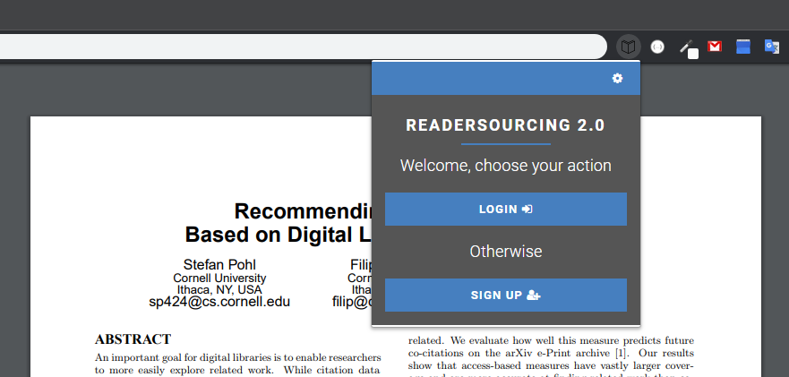
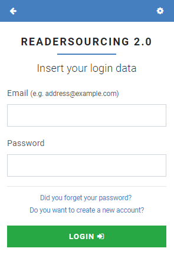
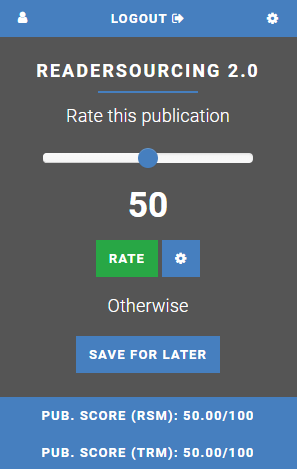
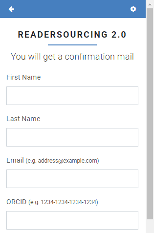
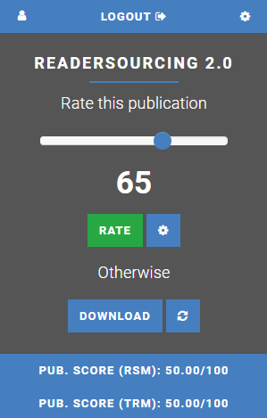
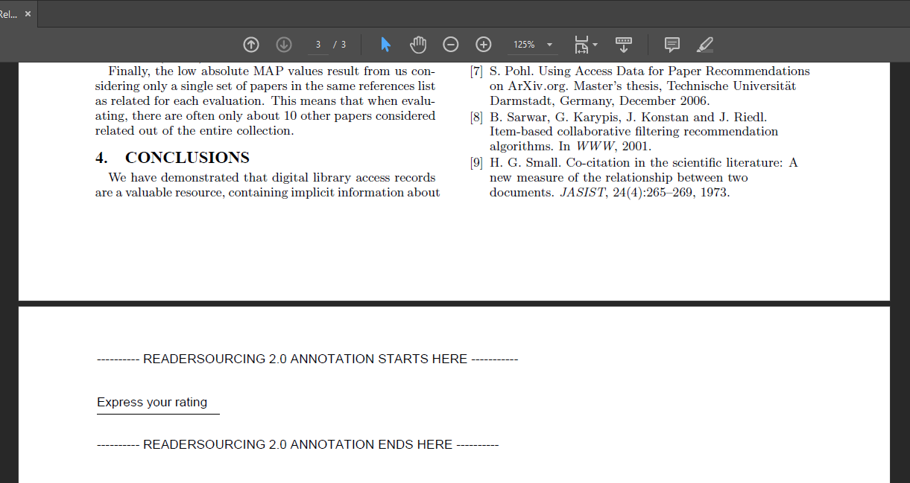
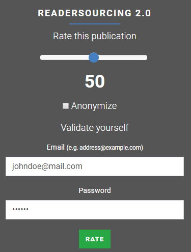
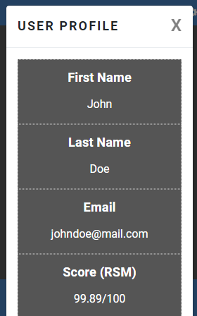

<h1>Info</h1>

This is the official repository of **RS_Rate**, which is part of the **Readersourcing 2.0** ecosystem. This repository is a [Git Submodule](https://git-scm.com/book/it/v2/Git-Tools-Submodules) of the main project, which can be found by taking advantage of the links below.

<h1>Useful Links</h1>

- <a href="https://readersourcing.org">Readersourcing 2.0 (Web Interface)</a>
- <a href="https://github.com/Miccighel/Readersourcing-2.0">Readersourcing 2.0 (GitHub)</a>
- <a href="https://zenodo.org/record/1446468">Original Article</a>
- <a href="https://zenodo.org/record/1452397">Technical Documentation (Zenodo)</a>
- <a href="https://github.com/Miccighel/Readersourcing-2.0-TechnicalDocumentation"> Technical Documentation (GitHub)</a>
- <a href="https://doi.org/10.5281/zenodo.1442599">Zenodo Record</a>

<h1>Description</h1>

**RS_Rate** is an extension designed to function as a client for the Readersourcing 2.0 ecosystem without 
requiring access to its website. Compatible with both [Google Chrome](https://www.google.com/chrome/)
and [Microsoft Edge](https://www.microsoft.com/en-us/edge/) the extension allows users to rate 
publications directly from their browsers. This eliminates the need to navigate to the main website, 
streamlining the process of providing ratings for publications.

The primary objective of **RS_Rate** is to provide readers with a way to seamlessly rate a publication with minimal 
effort—just a few clicks or keystrokes within the Readersourcing 2.0 ecosystem, contributing to a more dynamic 
online reading experience. **RS_Rate** serves as the initial client of our project, extending beyond the web-based 
interface available on the main portal.

Looking ahead, our vision includes expanding the compatibility of **RS_Rate** by developing implementations for 
other major browsers, such as Firefox, Safari, and other popular browsers. Our commitment is to make this rating 
tool accessible across a broad range of browsers, ensuring users can seamlessly interact with content and provide 
feedback, regardless of their preferred browser.

<h1>Installation</h1>

**RS_Rate** is freely available on the Google Chrome Web Store. To use it, simply take advantage of the following 
link and install the currently available version by clicking on the `Get` button shown on the store page. 
We plan to release a Firefox version in the future.

- _Google Chrome_ version: <a href="https://chrome.google.com/webstore/detail/readersourcing-20-rsrate/hlkdlngpijhdkbdlhmgeemffaoacjagg?hl=it">available here</a>

<h1>Usage</h1>

The image shown below illustrates a section of a Google Chrome instance with the extension active for a publication. 
This scenario depicts the typical situation of a reader visiting a publisher's website to access 
the PDF of a paper they are interested in. The image also displays the initial page that a reader 
encounters when interacting with the client. This page serves as a gateway to the login page, as shown 
in the second figure, or to the sign-up page. From the login page, a reader who has forgotten their password 
can access the password recovery page (not shown), which closely resembles the login page itself.

If a reader has yet to sign up for Readersourcing 2.0, they can navigate from the main page to sign-up one and fill in the form. 
Once they complete the standard sign-up and login operations, they will find themselves on the rating page.

In the central section of the rating page, a reader can use the slider to choose a rating value in a 0-100 interval. 
Once they select the desired rating, they only need to click the green `Rate` button, and that's it; with just 
three clicks and a slide action, they can submit their rating. Furthermore, they can also click the options button and, 
if preferred, check an option to anonymize the rating they are about to provide. It's important to note that the reader 
has to be logged in to express an anonymous rating to prevent spamming, which in this case would be a very dangerous 
phenomenon. When such a rating is processed, the information regarding its reader will not be used, except for preventing 
the reader from rating the same publication multiple times.

If the reader prefers to provide their rating at a later time instead of immediately rating the publication, 
they can click the `Save for later` button. This option allows them to take advantage of the editing 
procedure for publications, which stores a reference (an URL link) inside the PDF file they are viewing.
As soon as such the editing procedure is completed (usually just a few seconds), the `Save for later`
button transforms into a `Download` button.

The reader can finally download the link-annotated publication by clicking on it. Furthermore, 
they can also use the refresh button (located to the right of the `Download` button) to, as it says, 
refresh the link-annotated publication. This means that a new copy of the publication file will be downloaded, 
annotated, and made available to the reader. This feature is useful since a publication could be updated at a 
later time by its author.

As soon as the link-annotated publication is downloaded, the reader will find a PDF containing a new final 
page with the URL. Below, an example of such a link-annotated publication can be seen; 
in that case, the reader has chosen to open it with their favorite PDF reader.

Once the reader clicks on the reference, which is a special link to RS_Server, they will be taken to the server-side 
application itself. The interface presented allows them to express their rating independently of the browser extension 
used to store the reference. Therefore, if they send their link-annotated publication to a tablet-like device, for example, 
they can take advantage of the built-in browser to express their rating. Below, the interface that 
the reader sees after clicking on the stored reference is shown. The reader is required to authenticate themselves again as a form 
of security. Without this step, the stored reference could be used by anyone who gets a copy of the link-annotated publication.

Every time a reader rates a publication, every score is updated according to both `RSM` and `TRM` models, and each reader 
can see the result through RS_Rate. In the bottom section of the rating page, the score of the current publication can 
be seen (one for each model), as shown earlier. To view their score as a reader (once again, one for each model), a user 
must click the profile button in the upper right corner. Once they do that, they will see the corresponding interface. 
From there, they can also edit their password since that interface acts as a profile page.

