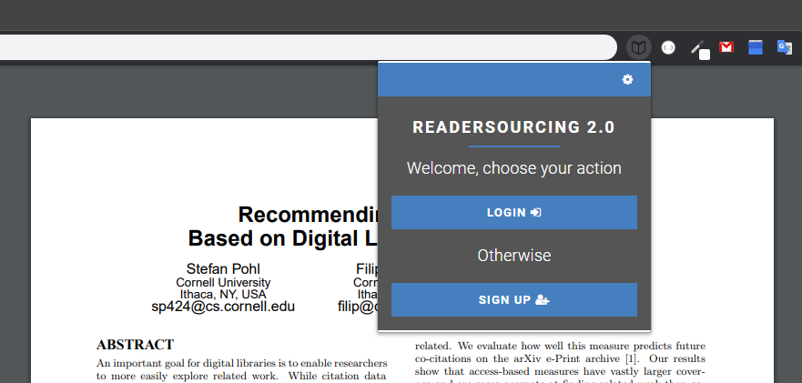
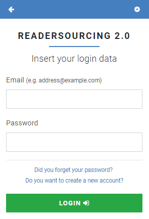
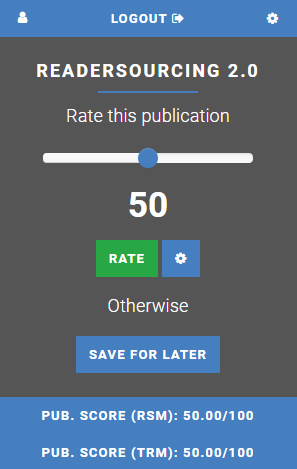
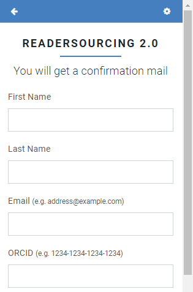
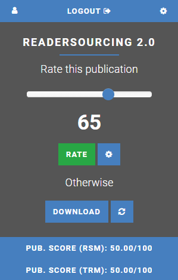
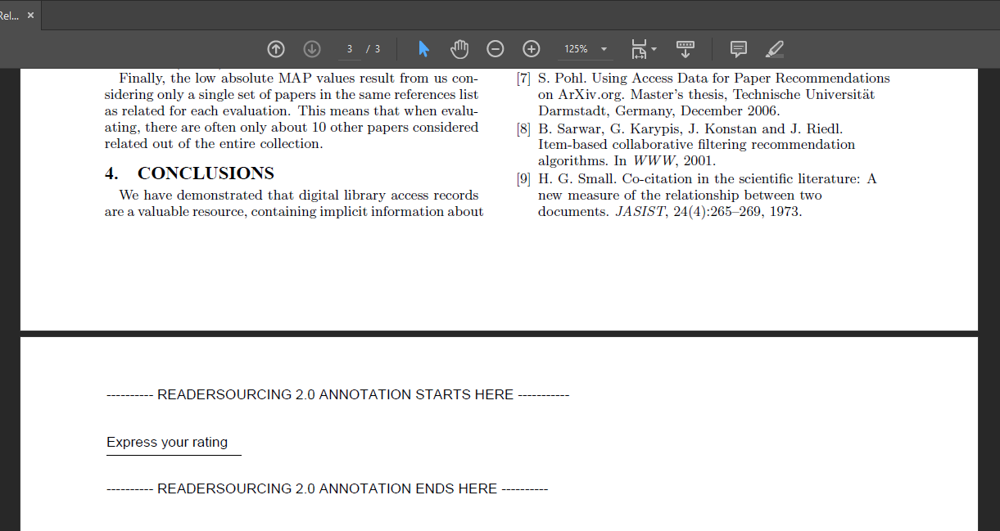
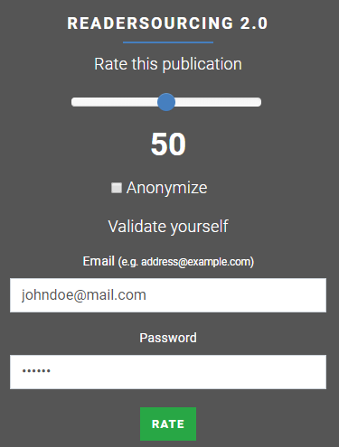
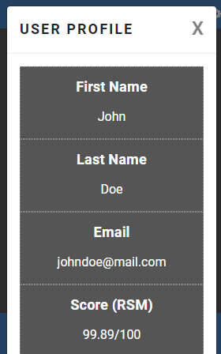

[](https://GitHub.com/Naereen/StrapDown.js/graphs/commit-activity)

[](https://GitHub.com/Miccighel/Readersourcing-2.0-RS_Rate/releases/)
[](https://GitHub.com/Miccighel/Readersourcing-2.0-RS_Rate/stargazers/)
[](https://GitHub.com/Miccighel/Readersourcing-2.0-RS_Rate/watchers/)
[](https://GitHub.com/Miccighel/Readersourcing-2.0-RS_Rate/graphs/contributors/)
[](https://GitHub.com/Miccighel/Readersourcing-2.0-RS_Rate/issues/)
[](https://GitHub.com/Miccighel/Readersourcing-2.0-RS_Rate/issues?q=is%3Aissue+is%3Aclosed)
[](https://GitHub.com/Miccighel/Readersourcing-2.0-RS_Rate/pull/)
[](https://GitHub.com/Miccighel/Readersourcing-2.0-RS_Rate/pull/)
[](http://makeapullrequest.com)

<h1>Info</h1>

This is the official repository of **RS_Rate**, which is part of the **Readersourcing 2.0** ecosystem. This repository is a [Git Submodule](https://git-scm.com/book/it/v2/Git-Tools-Submodules) of the main project, which can be found by taking advantage of the links below.

<h1>Useful Links</h1>

- <a href="https://readersourcing.com">Readersourcing 2.0 (Web Interface)</a>
- <a href="https://github.com/Miccighel/Readersourcing-2.0">Readersourcing 2.0 (GitHub)</a>
- <a href="https://zenodo.org/record/1446468">Original Article</a>
- <a href="https://zenodo.org/record/1452397">Technical Documentation (Zenodo)</a>
- <a href="https://github.com/Miccighel/Readersourcing-2.0-TechnicalDocumentation"> Technical Documentation (GitHub)</a>
- <a href="https://doi.org/10.5281/zenodo.1442599">Zenodo Record</a>

<h1>Description</h1>

**RS_Rate** is an extension designed to function as a client for the Readersourcing 2.0 ecosystem without 
requiring access to its website. Compatible with [Google Chrome](https://www.google.com/chrome/),
[Microsoft Edge](https://www.microsoft.com/en-us/edge/), and [Mozilla Firefox](https://www.mozilla.org/firefox/), the extension allows users to rate
publications directly from their browsers. This eliminates the need to navigate to the main website, 
streamlining the process of providing ratings for publications.

The primary objective of **RS_Rate** is to provide readers with a way to seamlessly rate a publication with minimal 
effort—just a few clicks or keystrokes within the Readersourcing 2.0 ecosystem, contributing to a more dynamic 
online reading experience. **RS_Rate** serves as the initial client of our project, extending beyond the web
interface available on the main portal.

Looking ahead, our vision includes expanding the compatibility of **RS_Rate** to
other major browsers, such as Safari. Our commitment is to make this rating
tool accessible across a broad range of browsers, ensuring users can seamlessly interact with content and provide 
feedback, regardless of their preferred browser.

<h1>Installation</h1>

The original 2019 release of **RS_Rate** remains available on the Google Chrome Web Store through the link below.
The current source produces complete builds for Chromium browsers and Firefox, which can be installed locally for
development. The Firefox build can also be packaged for validation and submission to Mozilla Add-ons.

- _Google Chrome_ version: <a href="https://chromewebstore.google.com/detail/readersourcing-20-rsrate/hlkdlngpijhdkbdlhmgeemffaoacjagg">available here</a>

<h1>Usage</h1>

The image shown below illustrates a section of a Google Chrome instance with the extension active for a publication. 
This scenario depicts the typical situation of a reader visiting a publisher's website to access 
the PDF of a paper they are interested in. The image also displays the initial page that a reader 
encounters when interacting with the client. This page serves as a gateway to the login page, as shown 
in the second figure, or to the registration page. From the login page, a reader who has forgotten their password
can request a recovery link. The link opens RS_Server, where the reader chooses and confirms a new password.





If a reader has yet to sign up for Readersourcing 2.0, they can navigate from the main page to the registration form.
Once they complete the standard registration and login operations, they will find themselves on the rating page.





In the central section of the rating page, a reader can use the slider to choose a rating value in a 0-100 interval. 
Once they select the desired rating, they only need to click the green `Rate` button, and that's it; with just 
three clicks and a slide action, they can submit their rating. Furthermore, they can also click the options button and, 
if preferred, check an option to anonymize the rating they are about to provide. It's important to note that the reader 
has to be logged in to express an anonymous rating to prevent spamming, which in this case would be a very dangerous 
phenomenon. When such a rating is processed, the information regarding its reader will not be used, except for preventing 
the reader from rating the same publication multiple times.

If the reader prefers to provide their rating at a later time instead of immediately rating the publication,
they can use the `Download` button in the `Save For Later` section. The extension first reports that the publication is
ready to prepare. After the reader continues, RS_Server retrieves the source once, opens it as a PDF, adds the rating page,
and verifies the result before making it available. The status area communicates each phase and distinguishes problems
such as a source that requires browser access, a size limit, an invalid PDF, or a failed final verification.

Some publishers make a PDF available only through the reader's browser session. In that case, the reader can select
`Use a local PDF` and upload the original file already available on the device. RS_Server subjects the uploaded source to
the same size limit, PDF validation, annotation, and final verification used for a directly retrieved publication.



The reader can finally open the prepared publication by clicking on it. Furthermore,
they can also use the refresh button (located to the right of the `Download` button) to, as it says, 
refresh the annotated publication. This means that a new copy of the publication file will be downloaded,
annotated, and made available to the reader. This feature is useful since a publication could be updated at a 
later time by its author.

As soon as the annotated publication is downloaded, the reader will find a PDF containing a new final
page with the rating link and QR Code. Below, an example of such an annotated publication can be seen;
in that case, the reader has chosen to open it with their favorite PDF reader.



Once the reader clicks on the reference, which is a special link to RS_Server, they will be taken to the RS_Server
application itself. The interface presented allows them to express their rating independently of the browser extension 
used to store the reference. Therefore, if they send their annotated publication to a tablet or a similar device, for example,
they can take advantage of its browser to express their rating. Below, the interface that
the reader sees after clicking on the stored reference is shown. The reader is required to authenticate themselves again as a form 
of security. Without this step, the stored reference could be used by anyone who gets a copy of the annotated publication.



Every time a reader rates a publication, every score is updated according to both `RSM` and `TRM` models, and each reader 
can see the result through RS_Rate. In the bottom section of the rating page, the score of the current publication can 
be seen (one for each model), as shown earlier. To view their score as a reader (once again, one for each model), a user 
must click the profile button in the upper right corner. Once they do that, they will see the corresponding interface. 
From there, they can also edit their password since that interface acts as a profile page.



<h1>Development</h1>

The development stack uses Node.js 24 LTS and Yarn 4. Dependencies are declared in `package.json` and
resolved reproducibly through the committed `yarn.lock`.

The Chromium and Firefox metadata are declared in `manifest.json` and `manifest-ff.json`, respectively. The build
copies the appropriate declaration into each package as `manifest.json`.

```console
corepack enable
yarn install --immutable
yarn verify
```

`yarn verify` creates complete Manifest V3 extension packages in `dist/chromium/` and `dist/firefox/`, checks that all
executable assets are bundled locally, validates the Firefox package with Mozilla's `web-ext`, and runs the client
contract tests. To try the Chromium build, open the Chrome or Edge extensions management page, enable developer mode,
choose `Load unpacked`, and select `dist/chromium/`. In Firefox, open `about:debugging#/runtime/this-firefox`, choose
`Load Temporary Add-on`, and select `dist/firefox/manifest.json`.

To create both browser archives:

```console
yarn package
```

The command writes `rs_rate-chromium.zip` and `rs_rate-firefox.zip` to `artifacts/`. To create only one archive, use:

```console
yarn package:chromium
yarn package:firefox
```

The Firefox target requires Firefox 142 or later and declares the data
categories needed by RS_Rate: account authentication and identity, the current publication URL, rating and save
interactions, and publication/PDF content sent to the configured RS_Server. These categories describe the application
traffic required by the domain workflow. RS_Rate has no separate analytics channel.

The development build uses `http://localhost:3000/` as the initial RS_Server host. The value can be changed from the
extension options and is preserved when the extension is updated. Both regular API calls and PDF extraction use this
same configured host. When a host is saved, the browser asks for permission to contact that HTTP or HTTPS origin.
Only the selected origin is granted; a configured application path remains part of the RS_Server address.

RS_Rate uses Bootstrap 4 because its views and UI plugins depend on Bootstrap 4 markup and jQuery integration. An
interface based on Bootstrap 5 would require coordinated changes to those views and plugins.
